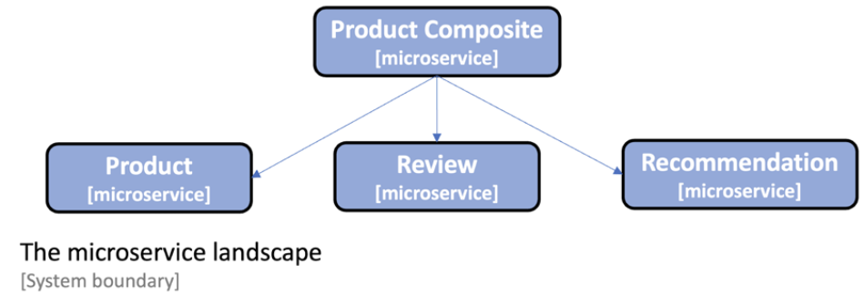

# microservices-with-spring-boot-3-and-spring-cloud-build-2023
Microservices with Spring Boot 3 and Spring Cloud: Build Resilient and Scalable Microservices Using Spring Cloud, Istio, and Kubernetes

the microservice-based system landscape that we will use throughout this book:

It consists of three core microservices, the product, review, and recommendation services, all of
which deal with one type of resource, and a composite microservice called the Product Composite
service, which aggregates information from the three core services.

The Protocol layer handles protocol-specific logic. It is very thin, only consisting of the RestController
annotations in the api project and the common GlobalControllerExceptionHandler in the util
project. The main functionality of each microservice resides in each Service layer. 

The product-composite service contains an Integration layer used to handle the communication 
with the three core microservices. The core microservices will all have a Persistence layer used for 
communicating with their databases.

Besides using Spring Data, we  will also use a Java bean mapping tool, MapStruct, which makes it easy to transform between Spring Data entity objects and the API model classes.

To keep the source code examples in this book easy to understand, they have a minimal amount of
business logic. The information model for the business objects they process is kept minimal for the
same reason. In this section, we will go through the information that’s handled by each microservice,
including infrastructure-related information.

## The product service
The product service manages product information and describes each product with the following
attributes:

• Product ID
• Name
• Weight
## The review service
The review service manages product reviews and stores the following information about each review:

• Product ID
• Review ID
• Author
• Subject
• Content

## The recommendation service
The recommendation service manages product recommendations and stores the following information about each recommendation:

• Product ID
• Recommendation ID
• Author
• Rate
• Content

## The product composite service
The product composite service aggregates information from the three core services and presents
information about a product as follows:

• Product information, as described in the product service
• A list of product reviews for the specified product, as described in the review service
• A list of product recommendations for the specified product, as described in the recommendation service

## api project
First, we will set up a separate Gradle project where we can place our API definitions. We will
use Java interfaces in order to describe our RESTful APIs and model classes to describe the
data that the API uses in its requests and responses. To describe what types of errors can be
returned by the API, a number of exception classes are also defined. Describing a RESTful
API in a Java interface instead of directly in the Java class is, to me, a good way of separating
the API definition from its implementation. 

The api project will be packaged as a library; that is, it won’t have its own main application class.
## util project
util project that hold some helper classes that are shared by our microservices, for example, for handling errors in a uniform way
## Infrastructure-related information
Once we start to run our microservices as containers that are managed by the infrastructure (first
Docker and later on Kubernetes), it will be of interest to track which containers actually responded
to our requests. As a simple solution, a serviceAddress attribute has been added to all responses,
formatted as hostname/ip-address:port.

## System
We will develop microservices that contain business logic based on plain Spring Beans and expose REST APIs using Spring WebFlux. The APIs will be documented based on the OpenAPI Specification using springdoc-openapi. To make the data processed by the microservices persistent, we will use Spring Data to store data in both SQL and NoSQL databases.

we will use Docker to run our microservices as containers. This will allow us to start and stop our microservice landscape, including database servers and a message broker, with a single command.

## Database
we will use the Spring Data project to persist data to MongoDB and Postgres databases.

The product and recommendation microservices will use Spring Data for MongoDB and the review microservice will use Spring Data for the Java Persistence API (JPA) to access a Postgres database.

## Technical requirements
• Spring Boot
• Spring WebFlux
• springdoc-openapi
• Spring Data
• Spring Cloud Stream
• Docker

## Development
Since, at this stage, we don’t have any service discovery mechanism in place, we will run all microservices on localhost and use hardcoded port numbers for each microservice. We will use the following
ports:
• The product composite service: 7000
• The product service: 7001
• The review service: 7002
• The recommendation service: 7003

### Prerequistes
install the Spring Boot CLI:

sdk install springboo
### Generating skeleton microservices
To simplify setting up the projects, we will use Spring Initializr to generate a skeleton project for each microservice. Run 

./create-projects.bash

## Manage DB
access data stored in MongoDB with a command like the following:
 
 docker-compose exec mongodb mongosh product-db --quiet --eval "db.products.find()"
### Build locally
We can build each microservice separately with the following command:

cd microservices/product-composite-service; ./gradlew build; cd -; \
cd microservices/product-service; ./gradlew build; cd -; \
cd microservices/recommendation-service; ./gradlew build; cd -; \
cd microservices/review-service; ./gradlew build; cd -;

cd microservices/product-composite-service; ./mvnw install; cd -; \
cd microservices/product-service; ./mvnw install; cd -; \
cd microservices/recommendation-service; ./mvnw; install -; \
cd microservices/review-service; ./mvnw install; cd -;

we can build all the microservices with one command:

./gradlew build

./mvnw install

./mvnw clean package spring-boot:repackage -pl microservices/product-composite-service  -DskipTests & \
./mvnw clean package spring-boot:repackage -pl microservices/product-service  -DskipTests & \
./mvnw clean package spring-boot:repackage -pl microservices/recommendation-service  -DskipTests & \
./mvnw clean package spring-boot:repackage -pl microservices/review-service  -DskipTests

java -jar microservices/product-composite-service/target/*.jar & \
java -jar microservices/product-service/target/*.jar & \
java -jar microservices/recommendation-service/target/*.jar & \
java -jar microservices/review-service/target/*.jar &
### Build using docker
cd microservices/product-service

docker build -t product-service .

docker run --rm -p 8080:8080 -e "SPRING_PROFILES_ACTIVE=docker" product-service

### Build using docker compose

./mvnw clean install -DskipTests

cd microservices && ../mvnw clean package spring-boot:repackage && cd ..

docker-compose build

docker-compose up -d

docker-compose down

./mvnw install && docker-compose build && docker-compose up

./gradlew build && docker-compose build && docker-compose up

### Test

#### Locally
chmod +x test-em-all.bash 

./test-em-all.bash

#### Docker
./test-docker.sh start stop
### Run
cd microservices/

../mvnw -pl product-service spring-boot:run

../mvnw -pl recommendation-service spring-boot:run

../mvnw -pl review-service spring-boot:run

../mvnw -pl product-composite-service spring-boot:run

### Access
OpenAPI documentation

http://localhost:8080/openapi/swagger-ui.html
#### locally
curl http://localhost:7001/product/123

curl http://localhost:7000/product-composite/123  -s | jq .

#### docker

curl localhost:8080/product-composite -s | jq .
curl localhost:8080/product-composite/123 -s | jq .

